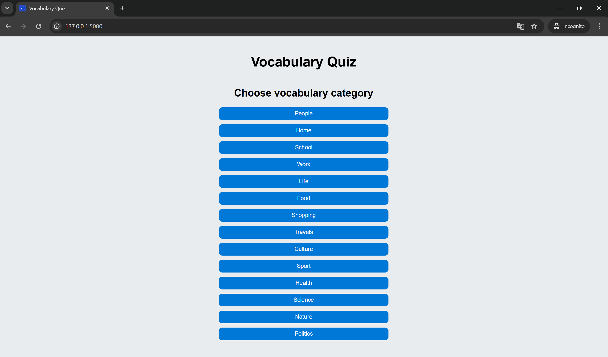
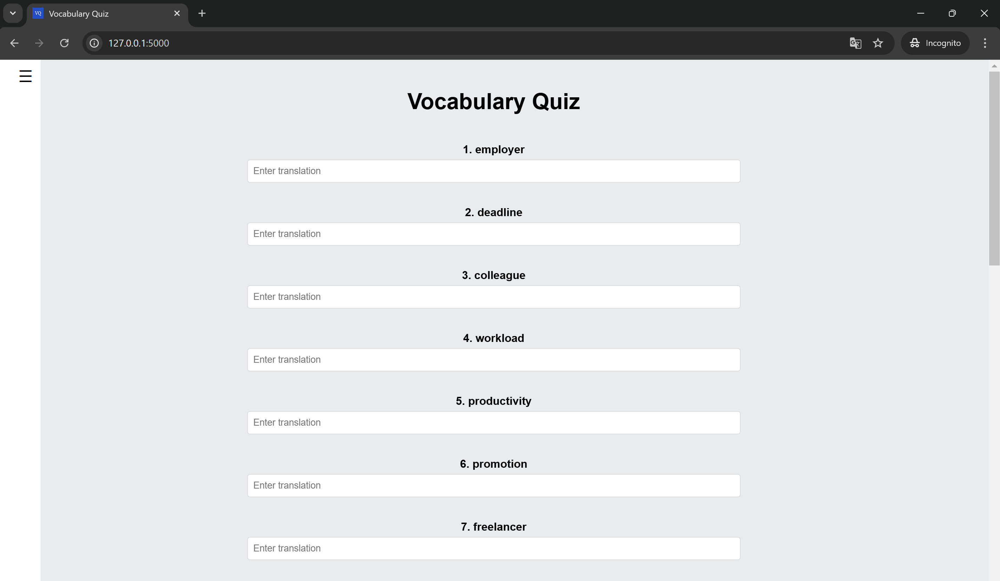
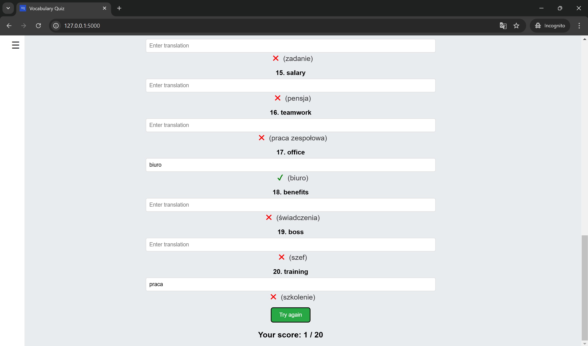
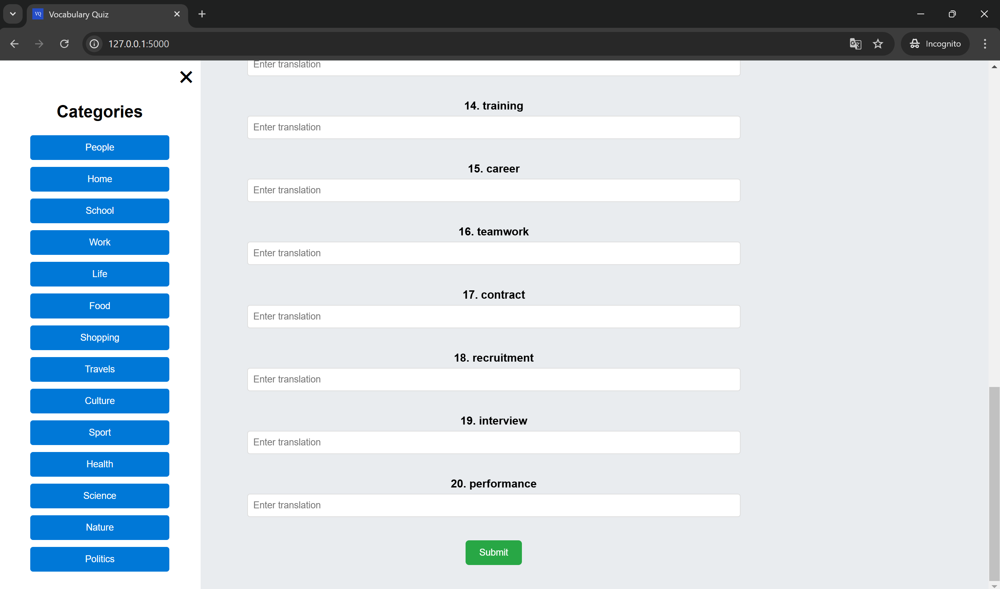

# **Vocabulary Quiz Web App**

The Vocabulary Quiz Web App is designed to help users enhance their vocabulary through engaging and interactive quizzes. Each quiz presents a series of words, and users must type the correct translation. With instant feedback, the app makes learning both effective and enjoyable. Featuring multiple categories and a user-friendly interface, the app ensures comprehensive vocabulary improvement while keeping the learning process fun and accessible.

## **Installation**

### Requirements:
- Python 3
- pip3 (Python package installer)

### Steps:
1. Clone the repository:
    ```bash
    git clone https://github.com/justkow/vocabulary-quiz-web-app.git
    ```
2. Navigate to the project directory:
    ```bash
    cd vocabulary-quiz-web-app
    ```

#### Option 1: Run Locally with Python
3. Install dependencies:
    ```bash
    pip3 install flask requests
    ```
4. In the `app.py` file, in the last line of code, change the address from `0.0.0.0` to `127.0.0.1`. Then start the application:
    ```bash
    python3 app.py
    ```

#### Option 2: Run with Docker
3. Build the Docker image:
    ```bash
    docker build -t quiz-app .
    ```
4. Start the Docker container:
    ```bash
    docker run -d -p 127.0.0.1:5000:5000 --name quiz-app quiz-app
    ```

5. Open your browser and go to `http://127.0.0.1:5000`

## Screenshots

### Home Page


### Quiz Page


### Results Page


### Categories selection sidebar


## Technologies

- Frontend: HTML5, CSS3, JavaScript (Vanilla JS)
- Backend: Python (Flask, Requests)
- Package Manager: pip3
